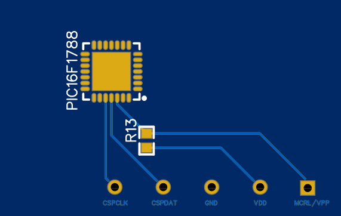
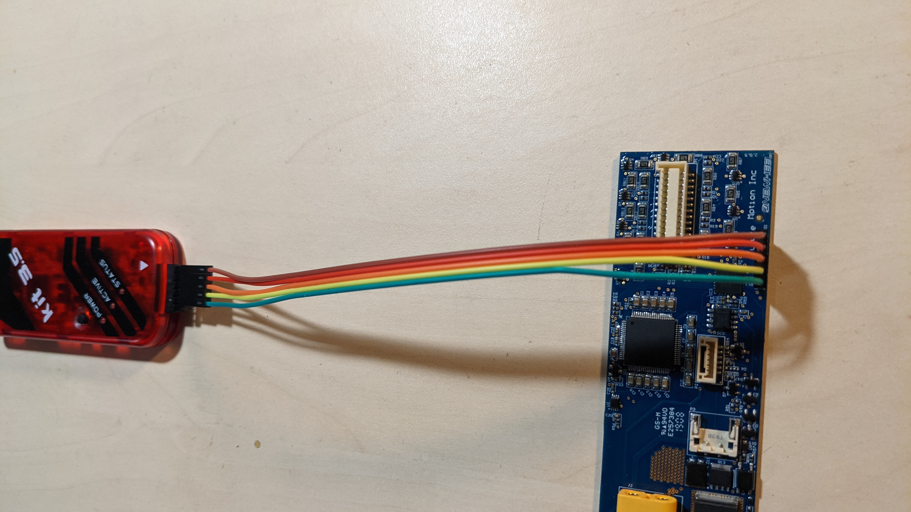

# Tools

You will need additional hardware to manipulate the firmware in the BMS:
* PICkit3 programmer (original) [https://www.microchip.com/Developmenttools/ProductDetails/PG164130](https://www.microchip.com/Developmenttools/ProductDetails/PG164130)
* PICkit3.5 (clone, I tested with this one) [https://www.amazon.com/Bolsen-PICKIT3-5-Programmer-Programming-Simulation/dp/B07VLMFW8K](https://www.amazon.com/Bolsen-PICKIT3-5-Programmer-Programming-Simulation/dp/B07VLMFW8K)
* Other versions will be probably fine too. You will just have to research bit more.

As for software, you will need **MPLAB IPE**
* **Dowload:** It's included in a package together with MPLAB X IDE: [https://www.microchip.com/en-us/development-tools-tools-and-software/mplab-x-ide](https://www.microchip.com/en-us/development-tools-tools-and-software/mplab-x-ide)
* Read more about `MPLAB IPE`: [https://www.microchip.com/en-us/development-tools-tools-and-software/embedded-software-center/mplab-integrated-programming-environment](https://www.microchip.com/en-us/development-tools-tools-and-software/embedded-software-center/mplab-integrated-programming-environment)

# Wiring

* PICkit3 basic pinout: [pickit3_50002010B.pdf](assets/pickit3_50002010B.pdf)
* BMS `PROG1` pinout:
  * 
* Just connect pins with the same name together.
  * 
* Connect PICkit to PC.

# Downloading the firmware

# I have the `*.hex` file. Now what?

* [Consider supporting me.](https://github.com/sponsors/radimklaska) :)
* Check the BMS PCB revision (something like `2.0.5` in the corner of the PCB), board hardware version (`4209`, in your app, under `diagnostics`) and send info about your versions and `.hex` file to [radim@klaska.net](radim@klaska.net). Thanks! :)
* Have a look at [https://ghidra-sre.org/](https://ghidra-sre.org/)
* If your board is `4210` or newer, keep the backup in case you need to replace your BMS (Not confirmed to work.)
* Stay tuned - we might figure something out...
* Expectations:
  * Most likely no bigger battery "unlocks" for `4210` or newer.
  * Maybe BMS replacement on board with paired cotroller and BMS.
  * Just a matter of time until someone figures out the percentage fix for `4209` and older.
