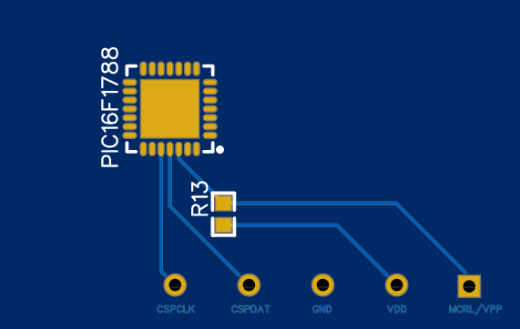
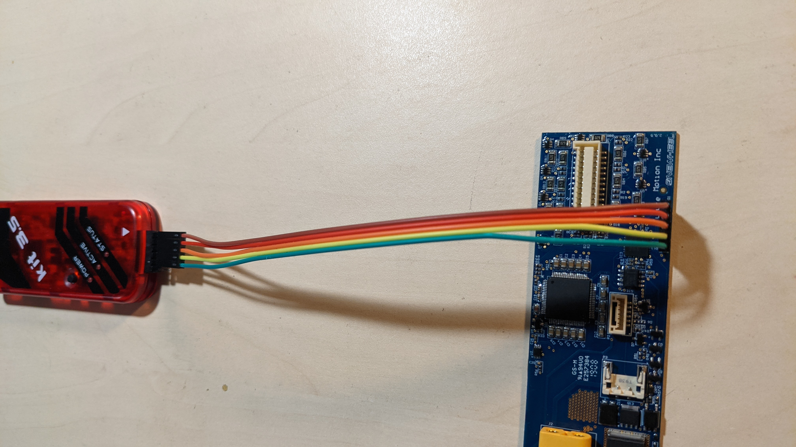

# Tools

You will need additional hardware to manipulate the firmware in the BMS:
* PICkit3 programmer (original) [https://www.microchip.com/Developmenttools/ProductDetails/PG164130](https://www.microchip.com/Developmenttools/ProductDetails/PG164130)
* PICkit3.5 (clone, I tested with this one) [https://www.amazon.com/Bolsen-PICKIT3-5-Programmer-Programming-Simulation/dp/B07VLMFW8K](https://www.amazon.com/Bolsen-PICKIT3-5-Programmer-Programming-Simulation/dp/B07VLMFW8K)
* Other versions will be probably fine too. You will just have to research bit more.

As for software, you will need **MPLAB IPE**
* **Dowload:** It's included in a package together with MPLAB X IDE: [https://www.microchip.com/en-us/development-tools-tools-and-software/mplab-x-ide](https://www.microchip.com/en-us/development-tools-tools-and-software/mplab-x-ide)
* Read more about `MPLAB IPE`: [https://www.microchip.com/en-us/development-tools-tools-and-software/embedded-software-center/mplab-integrated-programming-environment](https://www.microchip.com/en-us/development-tools-tools-and-software/embedded-software-center/mplab-integrated-programming-environment)

# Wiring

* PICkit3 basic pinout: [pickit3_50002010B.pdf](assets/pickit3_50002010B.pdf)
* BMS `PROG1` pinout:
  * 
* Just connect pins with the same name together.
  * 
* Connect PICkit to PC.

# Downloading the firmware

# I have the `*.hex` file. Now what?

* [Consider supporting me.](https://github.com/sponsors/radimklaska) :)
* Check the BMS PCB revision (something like `2.0.5` in the corner of the PCB), board hardware version (`4209`, in your app, under `dignostics`) and send info about your versions and `.hex` file to [radim@klaska.net](radim@klaska.net). Thanks! :)
* Have a look at [https://ghidra-sre.org/](https://ghidra-sre.org/)
  * This will decompile the `*.hex` and show actual code. (Keep in mind that decompiled code is ugly and not very intuitive.)
* If your board is `4210` or newer, keep the backup in case you need to replace your BMS (Not confirmed to work.)
* Stay tuned - we might figure something out...

# Expectations / Limitations

**What matters is the combination of hardware revision _and_ firmware version.** The
hardware revision alone does not decide whether a battery upgrade will work — a `4210`
board behaves very differently on `Gemini - 4144` than on `Gemini - 4165`.

Find both in the official app under `Diagnostics`. Hardware revisions are `42xx`;
XR firmware is styled `Gemini - 41xx`. They are easy to mix up.

## By hardware revision

|Relevant revisions|Expectation/Limitation|Note|
|---|---|---|
|4206 - 4209|No controller <-> BMS pairing. Battery upgrades work without a chip.||
|4210|**Controller <-> BMS pairing starts here.** Battery upgrades still possible on `Gemini - 4144` and older; a JWFFM or Owie chip is needed otherwise.|From `4210` the update process also pulls a **bootloader**, not just the firmware file.|
|4211|Paired. Battery upgrades need a chip.||
|4212|Paired. `Code Protection` enabled on the PIC on the BMS = no firmware downloads.|If the PCB is still the same, it should be possible to replace the chip and program it with older fw. It may not be paired any more, but it should work with older boards at least. Downgrading firmware on `4212` has been reported to leave boards unbootable.|
|4213|Paired. Same expectations as `4212`.|Not confirmed whether the `4212` downgrade limitation applies here.|

## By firmware version

|Firmware|Expectation/Limitation|Note|
|---|---|---|
|`Gemini - 4144` and older|Battery upgrades work. On `4210` hardware no chip is needed.|`4134` is the common shipping firmware for `4206` - `4209`.|
|`Gemini - 4150` - `4162`|Battery upgrades need a JWFFM or Owie chip.||
|`Gemini - 4165`|**Battery upgrades are not possible - a chip does not help.**|This is the haptic buzz firmware from the CPSC recall. The same file is used for every board; `4210` and newer also pull a new bootloader.|

There is also an authentication change at **`Gemini - 4141`**: older firmware uses a
challenge/response handshake, newer firmware uses serial-based authentication. Some
community tools support only one or the other.

General limitations of working with BMS firmware:
* Most likely no bigger battery "unlocks" for `4210` or newer with BMS alterations.
* A used board that a previous owner updated to `Gemini - 4165` has lost the ability to
  take a bigger battery.

Note: much of the above is aggregated from repair shops and the community rather than
from Future Motion, and some of it is still theory for me. Corrections welcome - see
[Credits]({{ site.baseurl }}/credits/).
