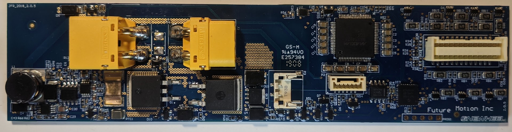
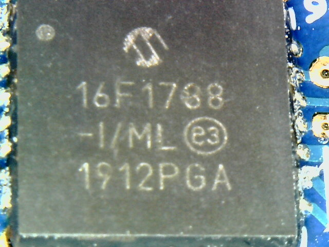
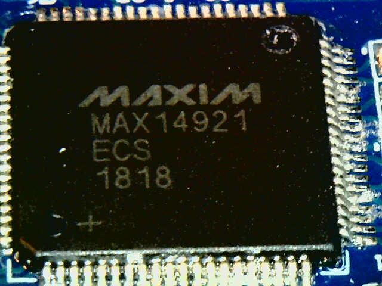
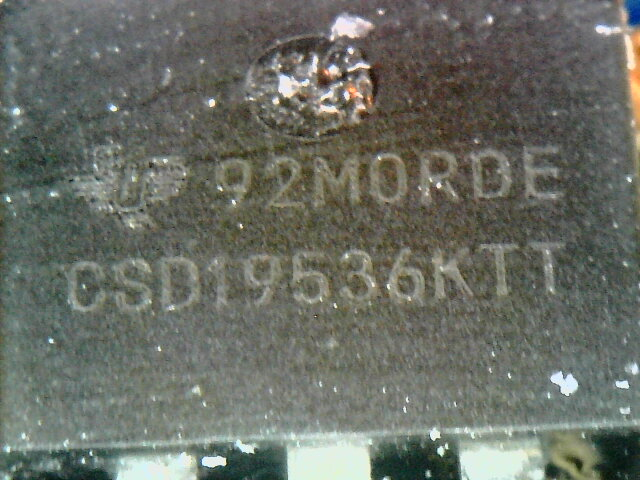
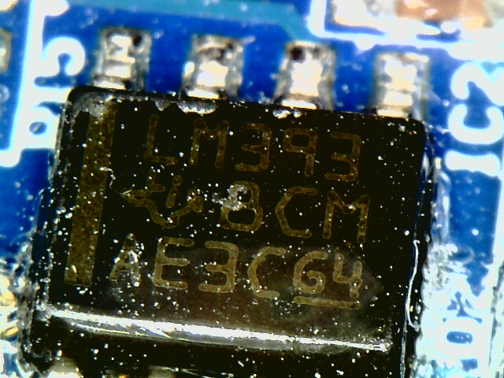
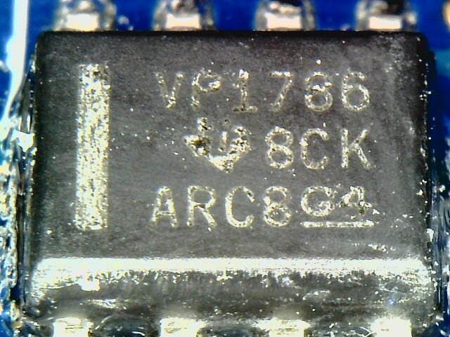
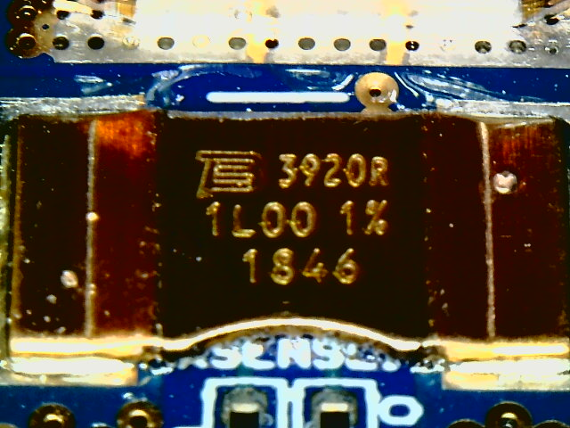

## BMS

#### +XR, HW: 4209, PCB v2.0.5

* `PIC16F1788-I/ML` RISC CPU
  * Datasheet: [40001675C.pdf](assets/40001675C.pdf)
  * this one sits in between the `MAX14921`'s SPI interface and exposed contacts on the PCB
  * 
* `PROG1` pinout:
  *   
* `MAX14921` battery measurement analog front-end
  * controlled by an SPI interface
  * Datasheet: [MAX14920-MAX14921.pdf](assets/MAX14920-MAX14921.pdf)
  * 
* `020N08N5` MOSFET
  * Datasheet: [Infineon-IPP020N08N5-DS-v02_01-en.pdf](assets/Infineon-IPP020N08N5-DS-v02_01-en.pdf)
  * 
* `CSD19536KTT` power MOSFET
  * Datasheet: [csd19536ktt.pdf](assets/csd19536ktt.pdf)
  * 
* `LM393-N` voltage comparator
  * Datasheet: [lm393-n.pdf](assets/lm393-n.pdf)
  * 
* `VP1786` (`SN65HVD1786D`) transceiver
  * Datasheet: [sn65hvd1791.pdf](assets/sn65hvd1791.pdf)
  * 
* `3920R 1L00 1% 1846` current sense resistor
  * Datasheet: [2629492.pdf](assets/2629492.pdf)
  * 

## Hardware version and PCB revision combinations

Note: This is based on very small sample size. (Currently about 10 boards.)

### +XR

| Hardware version | BMS PCB revision | Controller PCB revision |
|------------------|------------------|-------------------------|
| 4209             | v2.0.4 - v2.0.5  | r2.9                    |
| 4210             | v2.0.7           | ?                       |

### Pint

| Hardware version | BMS PCB revision | Controller PCB revision |
|------------------|------------------|-------------------------|
| 5300             | v2.0.7           | r3.1.3                  |
| 5314             | v2.0.7           | ?                       |

## Balance port pinout

Close-up of the BMS connector pinout and the XT-60 connector

Each pack has 4 10k NTC Thermistors placed in-between cells for temperature monitoring.
