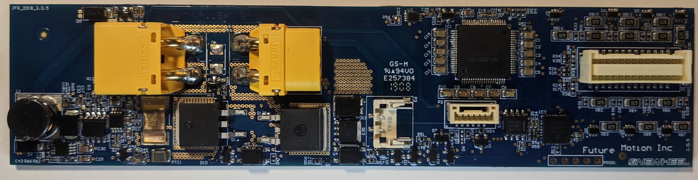
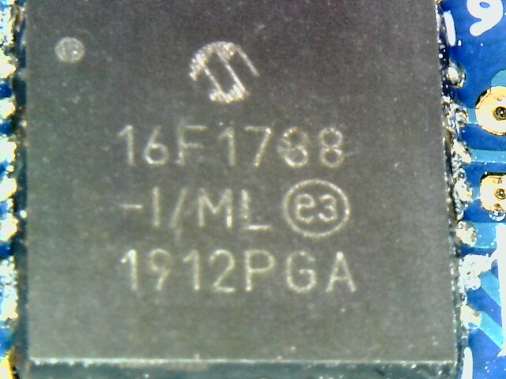
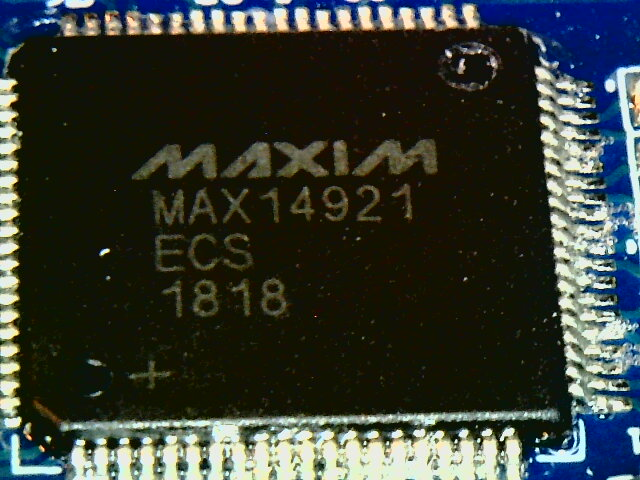
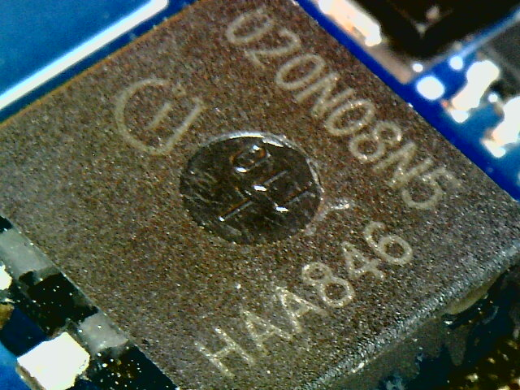
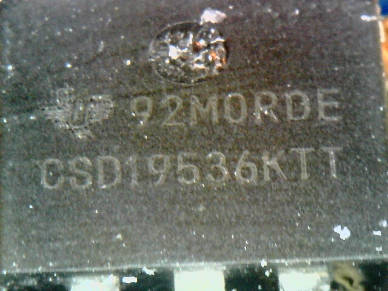
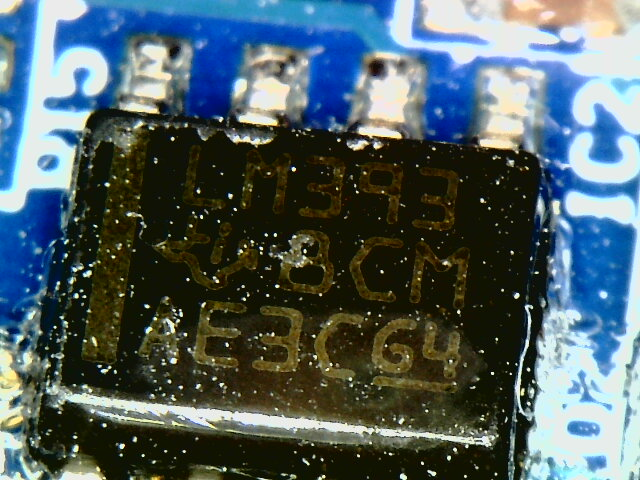
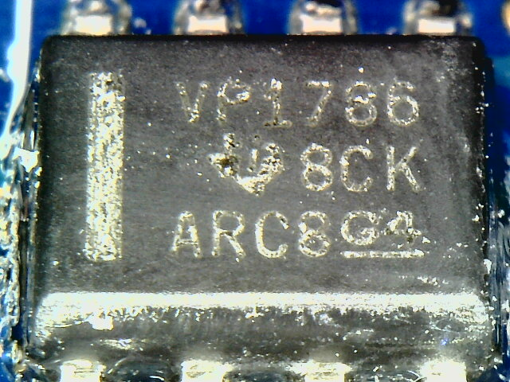
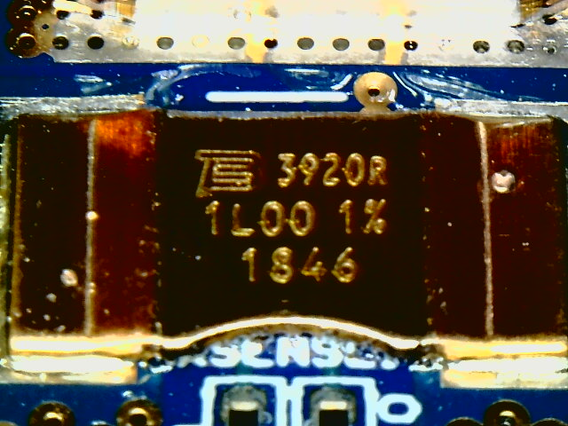
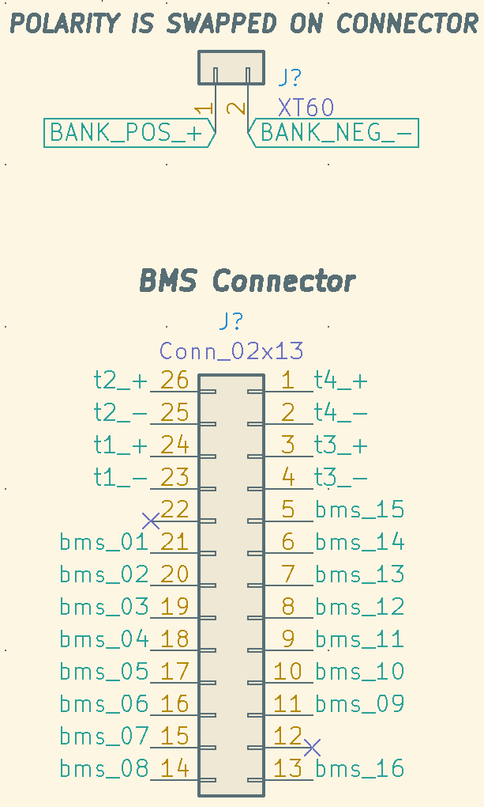

## BMS

#### +XR, HW: 4209, PCB v2.0.5

* `PIC16F1788-I/ML` RISC CPU
  * Datasheet: [40001675C.pdf](assets/40001675C.pdf)
  * this one sits in between the `MAX14921`'s SPI interface and exposed contacts on the PCB
  * [https://www.digikey.com/products/en?KeyWords=PIC16F1788-I/ML](https://www.digikey.com/products/en?KeyWords=PIC16F1788-I/ML)
  * 
* `PROG1` pinout:
  * 
* `SN65HVD1786` RS-485 Transceiver (IC5 Marking)
  * Datasheet: [sn65hvd1786.pdf](assets/sn65hvd1786.pdf)
  * [https://eu.mouser.com/ProductDetail/595-SN65HVD1786DR](https://cz.mouser.com/ProductDetail/595-SN65HVD1786DR)
  * Connected to UART on PIC16
  * Differential Pair connected to 6-Pin Connecter
* `MAX14921` battery measurement analog front-end
  * controlled by an SPI interface
  * Datasheet: [MAX14920-MAX14921.pdf](assets/MAX14920-MAX14921.pdf)
  * 
* `020N08N5` MOSFET
  * Datasheet: [Infineon-IPB020N08N5-DS-v02_02-EN.pdf](assets/Infineon-IPB020N08N5-DS-v02_02-EN.pdf)
  * [https://www.digikey.com/en/products/detail/infineon-technologies/IPB020N08N5ATMA1/5960189](https://www.digikey.com/en/products/detail/infineon-technologies/IPB020N08N5ATMA1/5960189)
  * 
* `CSD19536KTT` power MOSFET
  * Datasheet: [csd19536ktt.pdf](assets/csd19536ktt.pdf)
  * [https://www.digikey.com/en/products/detail/texas-instruments/CSD19536KTT/5215835](https://www.digikey.com/en/products/detail/texas-instruments/CSD19536KTT/5215835)
  * 
* `LM393-N` voltage comparator
  * Datasheet: [lm393-n.pdf](assets/lm393-n.pdf)
  * 
* `VP1786` (`SN65HVD1786D`) transceiver
  * Datasheet: [sn65hvd1791.pdf](assets/sn65hvd1791.pdf)
  * 
* `3920R 1L00 1% 1846` current sense resistor
  * Datasheet: [2629492.pdf](assets/2629492.pdf)
  * 

### Connectors
* Amass XT60PW connectors for battery / controller power (note reversed polarity for battery connector)
* JAE ES9 male (on PCB) / female (on wire) connector for charger cable
  * https://www.digikey.com/en/products/detail/jae-electronics/ES9S002SZA/4867382
  * https://www.digikey.com/en/products/detail/jae-electronics/ES9P002VFZR1600/4867376
* JST GH 6-position female header used for connector to controller
  * https://www.digikey.com/en/products/detail/jst-sales-america-inc/BM06B-GHS-TBT/807804

## Hardware version and PCB revision combinations

Note: This is based on very small sample size. (Currently about 10 boards.)

### +XR

| Hardware version | BMS PCB revision | Controller PCB revision |
|------------------|------------------|-------------------------|
| 4209             | v2.0.4 - v2.0.5  | r2.9                    |
| 4210             | v2.0.7           | ?                       |

### Pint

| Hardware version | BMS PCB revision | Controller PCB revision |
|------------------|------------------|-------------------------|
| 5300             | v2.0.7           | r3.1.3                  |
| 5314             | v2.0.7           | ?                       |

## Balance port pinout

Close-up of the BMS connector pinout and the XT-60 connector

Each pack has 4 10k NTC Thermistors placed in-between cells for temperature monitoring.
