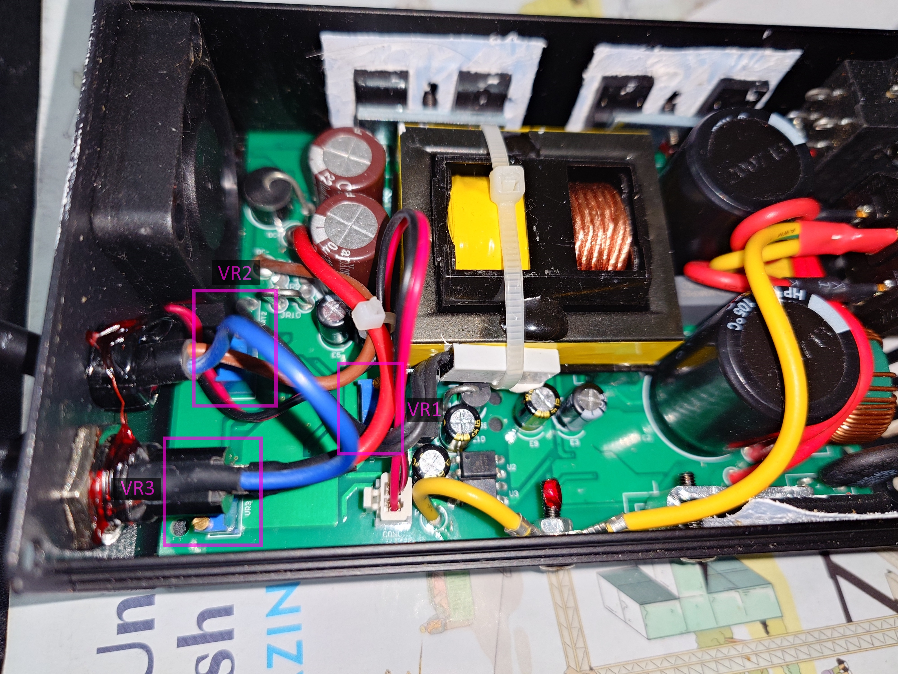
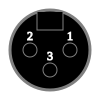

# Charger pinout

## OneWheel Pint Home Charger

63 V NMC battery charger
* Input: 100-240 Vac, 50/60 Hz, 1 A, 100 VA
* Output: 63 Vdc, 1.3 A

Connector (2 pin female mini DIN / GX12-2) pinout:

Voltage measurements across pairs of leads:

| - | + | Result  |
|---|---|---------|
| 1 | 2 | -63 Vdc |
| 2 | 1 | +63 Vdc |

Found polarity:

1. 63 Vdc
2. Ground

## ChiBatterySystems Onewheel Pint Fast Charger

* Input 1: 100-120 Vac, 50/60 Hz, 6 A
* Input 2: 200-240 Vac, 50/60 Hz, 3 A
* Output: 63 Vdc, 3.5 A

### Disassembly

> Warning: Mains AC voltage will be exposed if the charger is plugged in with the top cover removed.

To remove the top cover and access the PCB:

1. Remove the top 2 screws on each cover plate (4 total)
    - These are the screws on the side with the labelling
2. Gently squeeze the side walls of the case (the sides with the screws in the middle) and lift the top cover off

### Potentiometers

There are three potentiometers that adjust the calibration of the charger.

> Warning: Adjusting the setpoints of these potentiometers may damage your Onewheel.
> Before adjusting anything, measure the voltage of the charger with your own multimeter in case you need to readjust it back to defaults

- VR1: Voltage setpoint, clockwise to increase, counterclockwise to decrease
    - *Warning: Use a voltage meter to ensure the output is no more than 63V before plugging into your board*
- VR2: Current limit setpoint, clockwise to increase, counterclockwise to decrease
    - Can be decreased down to a minimum of ~1.8A to reduce likelihood of [burning the BMS side charge connector](https://www.reddit.com/r/onewheel/comments/1oys6sl/new_pint_bms_board/)
    - Can be adjusted with the charger connected to the board, use OWCE to monitor the charging current
- VR3: Unknown

## Onewheel+ XR Home Charger

63 V NMC battery charger
* Input: 100-240 Vac, 50/60 Hz, 300 VA
* Output: 63 Vdc, 3 A

Connector (3 pin female XLR) pinout:

Voltage measurements across pairs of leads:

| - | + | Result  |
|---|---|---------|
| 1 | 2 | 63 Vdc  |
| 1 | 3 | 63 Vdc  |
| 2 | 1 | -63 Vdc |
| 2 | 3 | 0 Vdc   |
| 3 | 1 | -63 Vdc |
| 3 | 2 | 0 Vdc   |

Found polarity:

1. Ground
2. 63 Vdc
3. 63 Vdc

## Other Models

The Onewheel+ is not NMC I don't think and the charger specs are
58 Vdc / 3.5 A I think, the Onewheel+ XR ultracharger is probably
63 Vdc / 5 A, but I don't know either of these, so I cannot verify
these numbers.

# Onewheel+ XR to Onewheel Pint Charger Adapter

Connectors:
* 3pin female XLR
* 2pin female mini DIN

Wiring:

| Onewheel+ XR | Onewheel+ Pint |
|--------------|----------------|
|   |   |
| 1            | 2              |
| 2            | 1              |
| 3            |                |
