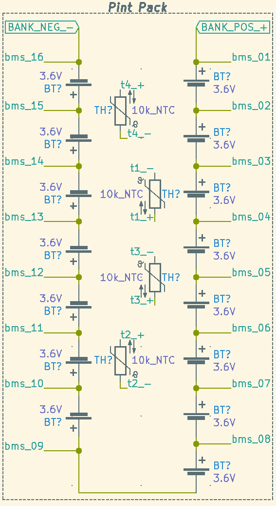

# ICs

## Controller

### Pint, HW: 5300, PCB r3.1.3

* `STM32F103R8T6` main CPU
  * Datasheet: [stm32f103c8.pdf](assets/stm32f103c8.pdf)

# Pint battery schema

Close-up of the Pint Battery pack layout w/ BMS connections. (Thermistors are just evenly placed around the pack between cells.)

