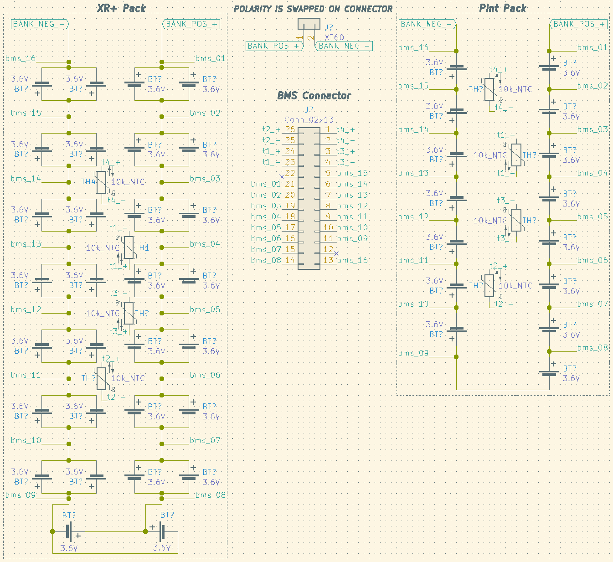
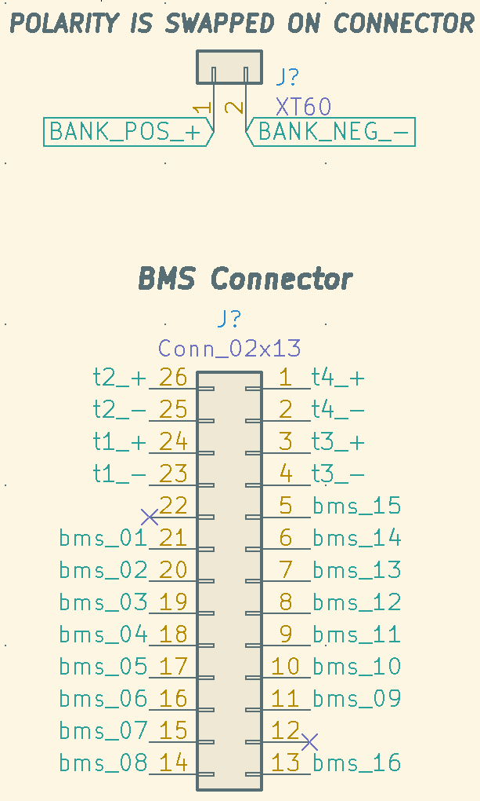

# [OneWheel technical info](https://radimklaska.github.io/onewheel/)

## Disclaimer

I'm just trying to aggregate bits of technical details I was able to find published on the internet. (See the credits section.) This is in no way a tutorial to do anything. I'm not responsible for any damage you cause by using this info. Even though I do my best to verify and double-check I'm not guaranteeing the correctness of the information aggregated in this repo.

## Help

* If you have time, please help by extending this page: [https://github.com/radimklaska/onewheel](https://github.com/radimklaska/onewheel)
* If you have money, please motivate me to extend this page: [https://github.com/sponsors/radimklaska](https://github.com/sponsors/radimklaska)

# ICs

## Controller

#### +XR, HW: 4209, PCB r2.9

* `STM32F103VBT6` main CPU
  * Datasheet: [stm32f103c8.pdf](assets/stm32f103c8.pdf)

#### Pint, HW: 5300, PCB r3.1.3

* `STM32F103R8T6` main CPU
  * Datasheet: [stm32f103c8.pdf](assets/stm32f103c8.pdf)

## BMS

#### +XR, HW: 4209, PCB v2.0.5

* `MAX14921` battery measurement analog front-end
  * controlled by an SPI interface
  * Datasheet: [MAX14920-MAX14921.pdf](assets/MAX14920-MAX14921.pdf)
* `PIC16F1788-I/ML` RISC CPU
  * Datasheet: [40001675C.pdf](assets/40001675C.pdf)
  * this one sits in between the `MAX14921`'s SPI interface and exposed contacts on the PCB
  * Current ToDo:
    * I think this is the IC that communicates with the controller and can be flashed to fix battery procentage in app when bigger battery is installed
      * onewheelrider.eu offers this firmware adjustment as a service: [https://onewheelrider.eu/en_US/p/CBXR-or-XXR-BATTERY-APPLICATION-ADJUSTMENT/148](https://onewheelrider.eu/en_US/p/CBXR-or-XXR-BATTERY-APPLICATION-ADJUSTMENT/148)
    * This IC should be programmable using
      * PICkit3 programmer [https://www.microchip.com/Developmenttools/ProductDetails/PG164130](https://www.microchip.com/Developmenttools/ProductDetails/PG164130)
        * basic pinout: [https://ww1.microchip.com/downloads/en/DeviceDoc/50002010B.pdf](https://ww1.microchip.com/downloads/en/DeviceDoc/50002010B.pdf)
        * manual: [http://ww1.microchip.com/downloads/en/DeviceDoc/51795B.pdf](http://ww1.microchip.com/downloads/en/DeviceDoc/51795B.pdf)
      * MPLAB IDE [https://www.microchip.com/en-us/development-tools-tools-and-software/mplab-x-ide](https://www.microchip.com/en-us/development-tools-tools-and-software/mplab-x-ide)
* `SN65HVD1786` RS-485 Transceiver (IC5 Marking)
  * Datasheet: [sn65hvd1786.pdf](assets/sn65hvd1786.pdf)
  * Connected to UART on PIC16
  * Differential Pair connected to 6-Pin Connecter

## Hardware version and PCB revision combinations

Note: This is based on very small sample size. (Currently about 10 boards.)

### +XR

| Hardware version | BMS PCB revision | Controller PCB revision |
|------------------|------------------|-------------------------|
| 4209             | v2.0.4 - v2.0.5  | r2.9                    |
| 4210             | v2.0.7           | ?                       |

### Pint

| Hardware version | BMS PCB revision | Controller PCB revision |
|------------------|------------------|-------------------------|
| 5300             | v2.0.7           | r3.1.3                  |

# OneWheel Battery schema and connector types

## Overview

Overview, BMS connector (battery pack side), XT-60 connector, and Pint/XR+ battery pack layouts.

Each pack has 4 10k NTC Thermistors placed in-between cells for temperature monitoring.

### Part numbers:

* XR+ cells
  * `Samsung 30Q 18650 3000mAh 15A`
  * [https://www.imrbatteries.com/samsung-30q-18650-3000mah-15a-battery/](https://www.imrbatteries.com/samsung-30q-18650-3000mah-15a-battery/)
* Pint cells
  * `Sony | Murata VTC5D 18650 2800mAh 25A`
  * [https://www.imrbatteries.com/sony-vtc5d-18650-2600mah-25a-battery/](https://www.imrbatteries.com/sony-vtc5d-18650-2600mah-25a-battery/)
* BMS Connector (PCB Side)
  * `BM26B-ZPDSS-TF(LF)(SN)`
  * [https://www.digikey.com/product-detail/en/jst-sales-america-inc/BM26B-ZPDSS-TF(LF)(SN)/455-2548-6-ND/2472626](https://www.digikey.com/product-detail/en/jst-sales-america-inc/BM26B-ZPDSS-TF(LF)(SN)/455-2548-6-ND/2472626)
* BMS Connector (Battery Pack)
  * `ZPDR-26V-S`
  * [https://www.digikey.com/product-detail/en/jst-sales-america-inc/ZPDR-26V-S/455-2536-ND/2472569](https://www.digikey.com/product-detail/en/jst-sales-america-inc/ZPDR-26V-S/455-2536-ND/2472569)
* BMS Connector Pins
  * `SZPD-002T-P0.3`
  * [https://www.digikey.com/product-detail/en/jst-sales-america-inc/SZPD-002T-P0.3/455-2539-1-ND/2472595](https://www.digikey.com/product-detail/en/jst-sales-america-inc/SZPD-002T-P0.3/455-2539-1-ND/2472595)
* 10k NTC Thermistors
  * `NTCLE413`
  * [https://www.digikey.com/catalog/en/partgroup/ntcle413/11021](https://www.digikey.com/catalog/en/partgroup/ntcle413/11021)

## BMS pinout

Close-up of the BMS connector pinout and the XT-60 connector

## +XR battery schema

Close-up of the XR+ Battery pack layout w/ BMS connections. (Thermistors are just evenly placed around the pack between cells.)

## Pint battery schema

Close-up of the Pint Battery pack layout w/ BMS connections. (Thermistors are just evenly placed around the pack between cells.)

# Charger pinout

## Onewheel Pint Home Charger

63 V NMC battery charger

- Input: 100-240 Vac, 50/60 Hz, 1 A, 100 VA
- Output: 63 Vdc, 1.3 A

Connector (2 pin female mini DIN) pinout:

Voltage measurements across pairs of leads:

| - | + | Result  |
|---|---|---------|
| 1 | 2 | -63 Vdc |
| 2 | 1 | +63 Vdc |

Found polarity:

1. 63 Vdc
2. Ground

## Onewheel+ XR Home Charger

63 V NMC battery charger

- Input: 100-240 Vac, 50/60 Hz, 300 VA
- Output: 63 Vdc, 3 A

Connector (3 pin female XLR) pinout:

Voltage measurements across pairs of leads:

| - | + | Result  |
|---|---|---------|
| 1 | 2 | 63 Vdc  |
| 1 | 3 | 63 Vdc  |
| 2 | 1 | -63 Vdc |
| 2 | 3 | 0 Vdc   |
| 3 | 1 | -63 Vdc |
| 3 | 2 | 0 Vdc   |

Found polarity:

1. Ground
2. 63 Vdc
3. 63 Vdc

## Other Models

The Onewheel+ is not NMC I don't think and the charger specs are
58 Vdc / 3.5 A I think, the Onewheel+ XR ultracharger is probably
63 Vdc / 5 A, but I don't know either of these, so I cannot verify
these numbers.

# Onewheel+ XR to Onewheel Pint Charger Adapter

Connectors:

- 3pin female XLR
- 2pin female mini DIN

Wiring:

| Onewheel+ XR | Onewheel+ Pint |
|--------------|----------------|
|   |   |
| 1            | 2              |
| 2            | 1              |
| 3            |                |

If you do this and it wrecks your board, blame yourself, because I
am not responsible for that.

# +XR Disassembly

## Open Controller box

## Open Battery box

## Bearings change

## Tire change

# Credits

* [TomasHubelbauer](https://github.com/TomasHubelbauer)
  * [Sponsor](https://github.com/sponsors/TomasHubelbauer)
  * Originaly started the repo
  * Pint and +XR charger info
* [radimklaska](https://github.com/radimklaska)
  * [Sponsor](https://github.com/sponsors/radimklaska)
  * Further info aggregation
  * Maintainig the struture, moderation...
  * Trying to keep everything up to date
  * ICs info (BMS and Controller)
* [That-Canadian](https://www.reddit.com/user/That-Canadian)
  * Battery schema, BMS pointous, connector types, cell types
  * Source:
    * OP: [https://imgur.com/a/Sif7Wlo#Axt8gvk](https://imgur.com/a/Sif7Wlo#Axt8gvk)
    * Reference: [https://www.reddit.com/r/onewheel/comments/iutvnf/onewheel_battery_pack_schematics/](https://www.reddit.com/r/onewheel/comments/iutvnf/onewheel_battery_pack_schematics/)
* [Grind671](https://www.youtube.com/channel/UC5Kx6GOUVHsvjwmENt6gKfg)
  * Open controller box video
* [WiTz life](https://www.youtube.com/channel/UCSzTq7j3rbYtSvsfUzVIBWQ)
  * Open battery box video
* [eevee's](https://www.youtube.com/channel/UCBLDQfwPv1NBQ1kJKfN3Zbw)
  * Bearings change video
* [The Float Life](https://www.youtube.com/channel/UCJDddEUqK26B0soFP23fvmA)
  * Tire change video
